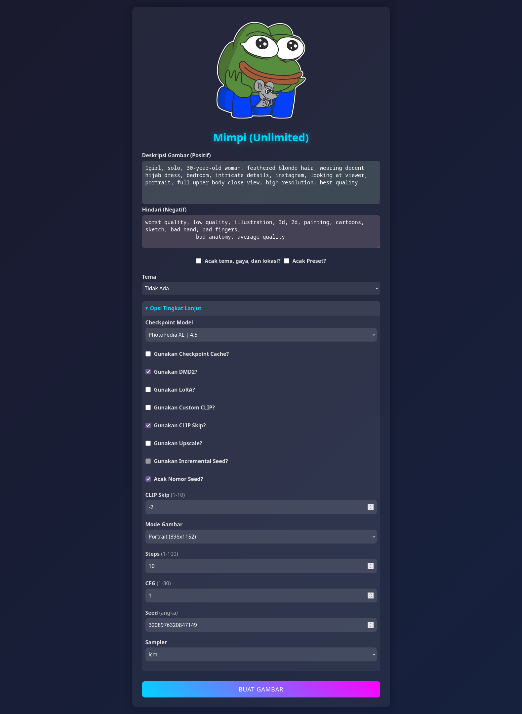

# Mimpi
#### A simple Web-to-ComfyUI API Bridge for Seamless Image Creation

This project provides a user-friendly web interface to interact with the ComfyUI API, enabling users to generate images directly without needing to open or configure ComfyUI manually. It simplifies the image generation process by abstracting the API complexities and offering an intuitive web-based workflow.

# Key Features
* No-Code Interaction: Generate images effortlessly through a simple web interface.
* Direct API Integration: Seamlessly connects to the ComfyUI API for real-time image generation.
* Customizable Parameters: Adjust settings like checkpoints, prompts, styles, and resolutions directly from the web interface.
* Responsive Design: Accessible on both desktop and mobile devices.
* Error Handling: Provides clear feedback for invalid inputs or API issues.
* Control: Download/delete the generated image with a single click
* Prompt Presets: Add/edit the built-in prompt presets
* Workflow: Integrated workflow for quick image generations

# How It Works
1. User Input: Enter prompts, select styles, and configure parameters via the web interface.
2. API Communication: The backend sends the input data to the ComfyUI API.
3. Image Generation: ComfyUI processes the request and generates the image.
4. Result Display: The generated image is displayed on the web interface for download or further editing.
5. To get the **NSFW/Unrestricted** access add ``?unlock`` to the URL, e.g. http://localhost:8000/?unlock

# Installation and Setup

**1. Prerequisites:**
- [ComfyUI](https://github.com/comfyanonymous/ComfyUI)
- Python (v3.11 or higher)
- ComfyUI API Access
- 

**2. Installation Steps:**
```bash
git clone https://github.com/MOVZX/Mimpi.git
cd Mimpi
python -m http.server 8000
```

# Preview


> [!NOTE]
> **Personal Motivation**
>
> This project was initially created out of my own need for convenience. As someone who frequently uses ComfyUI for image generation, I found it cumbersome to rely on desktop setups or manually configure parameters through the API. I wanted a simpler way to interact with ComfyUI directly from my smartphone, allowing me to generate images on the go without needing access to a full desktop environment.
>
> With this web interface, I achieved a streamlined workflow that works seamlessly on mobile devices. Whether I'm commuting, traveling, or simply away from my computer, I can now generate high-quality images anytime, anywhere, using just my phone.

# License
This project is licensed under the **MIT License**. See the  file for more details.
